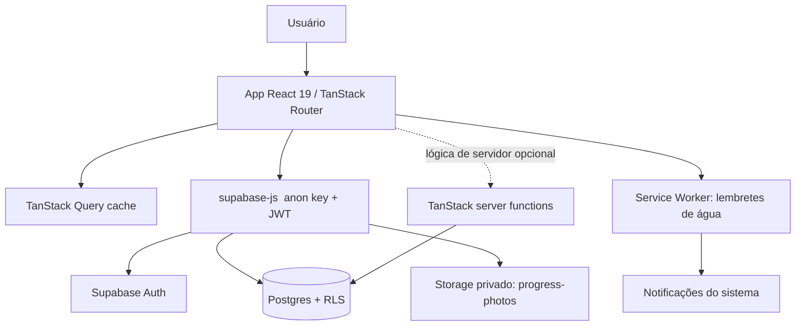
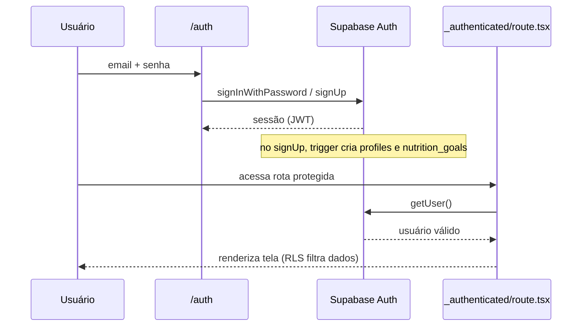
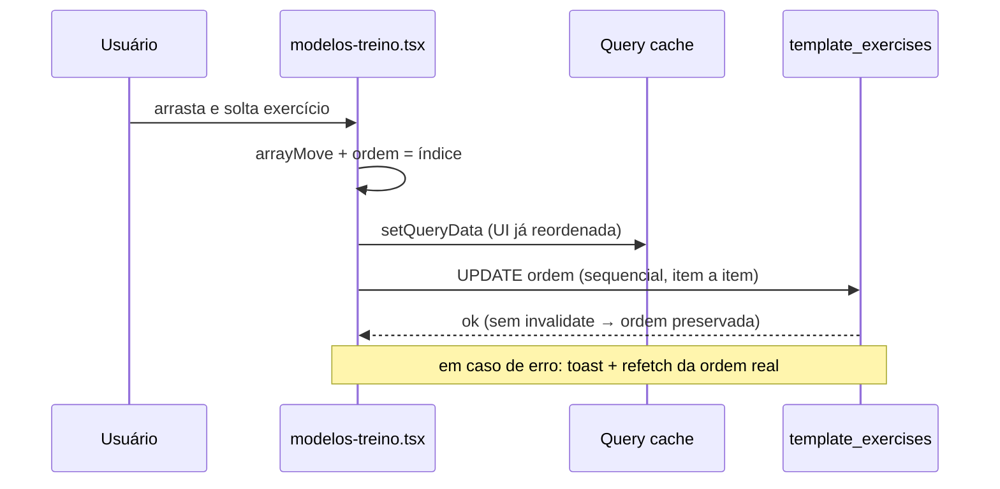
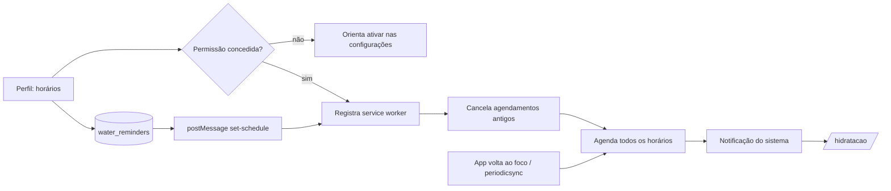
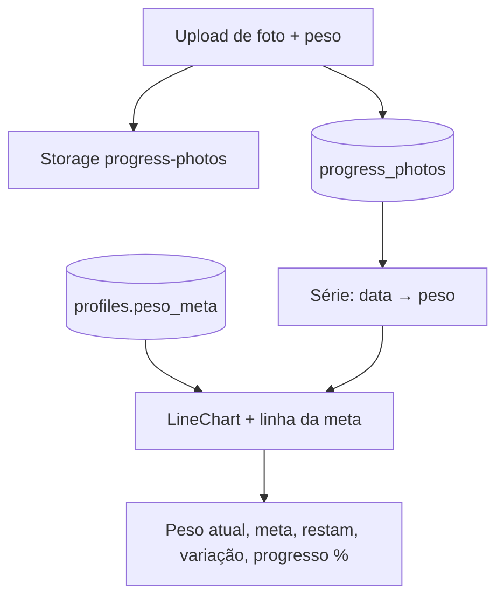
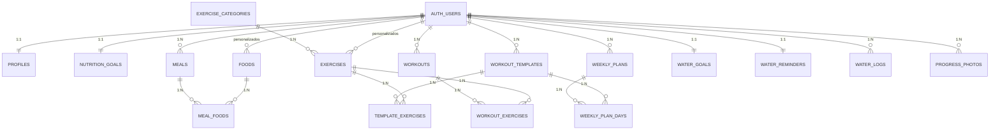
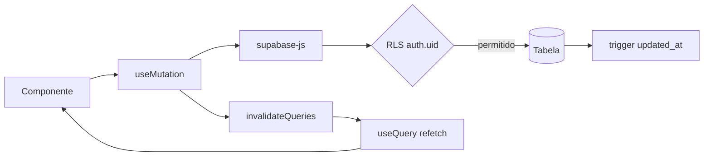

# Diagramas

Diagramas em Mermaid (renderizados automaticamente pelo GitHub).

## 1. Arquitetura

## 2. Fluxo de autenticação

## 3. Reordenação de exercícios (drag & drop)

## 4. Lembretes de água

## 5. Evolução física e gráfico de peso

## 6. Modelo entidade-relacionamento

## 7. Fluxo frontend → banco

